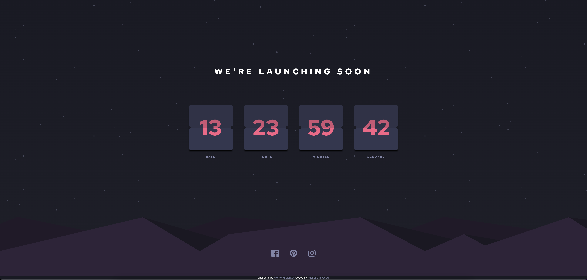

# Frontend Mentor - Launch countdown timer solution

This is a solution to the [Launch countdown timer challenge on Frontend Mentor](https://www.frontendmentor.io/challenges/launch-countdown-timer-N0XkGfyz-). Frontend Mentor challenges help you improve your coding skills by building realistic projects.

## Table of contents

- [Overview](#overview)
  - [The challenge](#the-challenge)
  - [Screenshots](#screenshots)
  - [Links](#links)
- [My process](#my-process)
  - [Built with](#built-with)
  - [What I learned](#what-i-learned)
  - [Continued development](#continued-development)
  - [Useful resources](#useful-resources)

## Overview

### The challenge

Users should be able to:

- See hover states for all interactive elements on the page
- See a live countdown timer that ticks down every second (start the count at 14 days)
- **Bonus**: When a number changes, make the card flip from the middle

### Screenshots

### Links

- [Live Site URL](https://luxury-sopapillas-9fc20c.netlify.app/)

## My process

### Built with

- Semantic HTML5 markup
- Mobile-first workflow
- [React](https://reactjs.org/)
- [Create React App](https://create-react-app.dev/)
- [Tailwind CSS](https://tailwindcss.com/docs/installation)

### What I learned

I used this exercise to learn how to use Tailwind CSS. Actually, it turned out to be a bit of a complicated design to use Tailwind on. 😅 But I did achieve this goal, and it was fun to use.

A pretty interesting gotcha I encountered was that using the provided background images in my components was throwing a 'module not found' error and crashing the app. After googling it I found this [Reddit post](https://www.reddit.com/r/tailwindcss/comments/jsgnzh/background_image_problem/). The problem was that when using Tailwind, all the styles end up in index.css, so relative paths need to originate from there rather than from the component's file.

I hadn't done a countdown timer before - [this blog post](https://blog.avneesh.tech/how-to-make-a-count-down-timer-in-react) by Avneesh Agarwal provides a great simple countdown timer solution. I adapted this for my timer. (If you use this article note that the hours variable in the code is missing a modulo.)

I also learned the [padStart()](https://developer.mozilla.org/en-US/docs/Web/JavaScript/Reference/Global_Objects/String/padStart) method in order to add leading zeros to the numbers.

Another challenge I encountered was working with SVG icons in React, and how to change their colour in order to achieve the hover state specification in the brief. I discovered that Create React App ships with [SVGR](https://react-svgr.com/), which lets you import SVGs as React components. Then I needed to edit the SVG files and change "fill" to "current", which means it will inherit the fill colours from the CSS styling. My component for the social icons then ended up quite concise which is always nice.

What didn't end up concise was the CSS for the calendar-style backgrounds behind the timer numbers! Using Tailwind for this looked so messy that I added them to Tailwind's 'components' as custom classes in index.css. Styled Components would possibly have been easier to read in this case...

### Continued development

As you can see I have not completed the bonus task, which is to give the cards a flipping animation, so that would be the next feature.

### Useful resources

- [Tailwind docs](https://tailwindcss.com/docs/installation)
- [Javascript Date reference](https://css-tricks.com/everything-you-need-to-know-about-date-in-javascript/)
- [React countdown timer](https://blog.avneesh.tech/how-to-make-a-count-down-timer-in-react)
- [Scooped corners hack](https://css-tricks.com/scooped-corners-in-2018/)
- [Styling SVG in React](https://stackoverflow.com/a/62532186/19179290)
